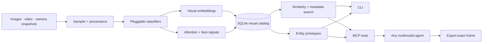

<p align="center">
  
</p>

<p align="center">
  <strong>A visual memory and attention layer for AI agents.</strong><br/>
  Index images and long videos once. Search, inspect, track, and retrieve the right frame in milliseconds.
</p>

<p align="center">
  <a href="#60-second-demo">60-second demo</a> ·
  <a href="#mcp-server">MCP server</a> ·
  <a href="#how-it-fits-together">Architecture</a> ·
  <a href="#model--library-credits">Credits</a>
</p>

---

VAAS is a compact prototype for treating vision as a **queryable data source**, not a stream of disposable screenshots. It gives an agent a CLI and an MCP server for image portfolios, recorded video, sampled camera feeds, attention timelines, coarse face signals, and persistent visual entities.

> This is portfolio-grade infrastructure: real, testable, and deliberately modular. It is not a production biometric, surveillance, or safety-critical system.

## See VAAS in action

<p align="center">
  <a href="assets/vaas-demo.mp4">
    
  </a>
</p>

<p align="center"><sub>19-second overview · click the animation for the full-quality MP4</sub></p>

## What it demonstrates

| Need | VAAS primitive | Included implementation |
|---|---|---|
| Search a large visual collection | image/text embeddings + cosine retrieval | tiny local descriptor; optional OpenCLIP |
| Find moments in long video | sampled frame index + scene/motion scores | OpenCV adapter |
| Keep attention over time | normalized saliency grid + focus centroid | NumPy contrast/edge/saturation pipeline |
| Recognize reactions | face boxes + smile signal | optional OpenCV Haar adapter |
| Resolve repeated subjects | online prototype centroids + observations | SQLite entity registry |
| Let any agent use it | typed tools over stdio | official MCP Python SDK |
| Pull the evidence | frame export with source/time provenance | image copy or precise video seek |

## 60-second demo

Requires Python 3.10+.

```bash
python -m venv .venv
source .venv/bin/activate
pip install -e '.[dev]'

# Creates a tiny synthetic portfolio, indexes it, and runs visual search.
python examples/quickstart.py
```

Or point the CLI at real media:

```bash
vaas index ~/Pictures/portfolio --tag portfolio
vaas search portfolio --limit 5
vaas search --image ~/Pictures/query.jpg --limit 5
vaas inspect asset_abc123
```

Video and coarse facial signals are opt-in:

```bash
pip install -e '.[video]'
vaas --face-signals index demo.mp4 --sample-every 1.5 --tag interview
vaas timeline demo.mp4
vaas export asset_abc123 exports/interesting-frame.jpg
```

The default descriptor is intentionally tiny and supports **example-image similarity**. For semantic text-to-image search, select OpenCLIP:

```bash
pip install -e '.[semantic]'
vaas --embedder openclip index ~/Pictures/portfolio
vaas --embedder openclip search "a red bicycle beside a brick wall"
```

The first OpenCLIP run downloads the selected model weights. A catalog only compares vectors produced by the same backend, so index and search with the same `--embedder` value.

## MCP server

Install the official SDK adapter and run over stdio:

```bash
pip install -e '.[mcp,video]'
vaas --db ~/.local/share/vaas/catalog.db serve
```

Example MCP client configuration:

```json
{
  "mcpServers": {
    "vaas": {
      "command": "/absolute/path/to/.venv/bin/vaas",
      "args": ["--db", "/absolute/path/to/vaas.db", "serve"]
    }
  }
}
```

The agent receives seven focused tools:

| MCP tool | Agent use |
|---|---|
| `visual_status` | Check the catalog, database, and active embedder |
| `index_visual_path` | Build memory from one file, a directory, or a video |
| `search_visual_memory` | Search by text/tags or an example image |
| `inspect_visual_asset` | Read provenance, attention, signals, and metadata |
| `read_attention_timeline` | Follow focus, motion, and shot changes over time |
| `resolve_visual_entity` | Map an observation to a stable visual subject |
| `export_visual_frame` | Materialize the source frame for multimodal inspection |

A useful agent loop looks like this:

```text
index_visual_path("meeting.mp4", sample_every_seconds=1)
→ search_visual_memory("whiteboard", limit=3)
→ inspect_visual_asset(best_asset_id)
→ export_visual_frame(best_asset_id, "exports/whiteboard.jpg")
→ agent inspects the exported image with its native vision model
```

## Python API

```python
from vaas import VAAS

vision = VAAS("vaas.db", embedder="visual", face_signals=False)
frames = vision.index_video("meeting.mp4", sample_every=2.0, max_frames=300)

matches = vision.search(image="whiteboard-photo.jpg", limit=5)
best = matches[0]
print(best.record.source_uri, best.record.timestamp, best.record.attention)

entity = vision.resolve_entity(best.record.id, kind="scene", label="planning board")
vision.export_frame(best.record.id, "exports/planning-board.jpg")
```

See [`examples/agent_workflow.py`](examples/agent_workflow.py) for a complete media-to-evidence flow.

## How it fits together



The package has one orchestration API, `VAAS`, used by both interfaces. Adapters conform to a small `Embedder` protocol. SQLite holds metadata and float32 vectors; NumPy performs exact cosine search. That makes the demo transparent and portable. At portfolio scale, swap the vector scan for Faiss, Qdrant, Milvus, or pgvector without changing the agent tools.

### Data model

```text
source ──< asset/frame ──> embedding
                 │
                 ├── attention {score, focus_x, focus_y, entropy, 8×8 grid}
                 ├── signals   {faces, smiles, adapter-specific outputs}
                 └── observation >── entity {kind, label, running centroid}
```

Every result preserves its original source, video timestamp, frame number, content hash, dimensions, embedding model, and analysis metadata. VAAS stores indexes—not copied media—unless `export` is explicitly called.

## Extending the sensing library

VAAS does not vendor model code. Add an adapter and keep weights/licenses with their upstream project:

```python
class MyEmbedder:
    name = "my-model:v1"

    def embed_image(self, image):
        return normalized_numpy_vector

    def embed_text(self, text):
        return normalized_numpy_vector


vision = VAAS("catalog.db", embedder=MyEmbedder())
```

Good next adapters include:

- **DINOv2** for general-purpose visual similarity and entity features.
- **SAM 2** for promptable object masks and temporal object tracking.
- **MediaPipe Face Landmarker** for blendshapes, head pose, and richer interaction signals.
- **PySceneDetect** for production-grade shot boundaries.
- **Faiss/HNSW** for million-scale approximate nearest-neighbor search.

## Boundaries and responsible use

- The built-in face adapter detects coarse face/smile patterns. It does **not** identify people, infer emotion, or establish intent.
- Smile detection is a noisy visual signal, not an emotional truth. Treat all facial outputs as uncertain observations.
- Obtain consent before processing cameras, calls, faces, or private media. Follow retention and access-control requirements.
- Keep a human in the loop for consequential uses. Benchmark every selected model on the actual domain and demographic mix.
- Validate paths and add authentication/authorization before exposing the MCP server beyond a trusted local process.

## Model & library credits

VAAS uses or is designed to interoperate with these excellent projects. Their code is referenced through normal dependencies; none is copied into this repository.

- [Pillow](https://python-pillow.org/) and [NumPy](https://numpy.org/) — image I/O and local numeric features.
- [SQLite](https://sqlite.org/) — portable catalog and entity registry.
- [OpenCV](https://docs.opencv.org/4.x/) — optional video decoding, shot/motion statistics, Haar face/smile signals.
- [OpenCLIP](https://github.com/mlfoundations/open_clip) — optional text/image embeddings; based on Radford et al., [*Learning Transferable Visual Models From Natural Language Supervision*](https://arxiv.org/abs/2103.00020).
- [MCP Python SDK](https://github.com/modelcontextprotocol/python-sdk) — the stdio agent interface.
- Oquab et al., [*DINOv2: Learning Robust Visual Features without Supervision*](https://arxiv.org/abs/2304.07193) — recommended general visual features adapter.
- Ravi et al., [*SAM 2: Segment Anything in Images and Videos*](https://arxiv.org/abs/2408.00714) — recommended mask and object-tracking adapter.
- Lugaresi et al., [*MediaPipe: A Framework for Building Perception Pipelines*](https://arxiv.org/abs/1906.08172) — recommended real-time landmark/blendshape adapter.
- Johnson, Douze, and Jégou, [*Billion-scale similarity search with GPUs*](https://arxiv.org/abs/1702.08734) and [Faiss](https://github.com/facebookresearch/faiss) — recommended large-scale vector index.

## Development

```bash
pip install -e '.[dev]'
pytest -q
ruff check .

# Regenerate the README MP4 and GIF (requires ffmpeg).
python scripts/render_readme_demo.py
```

The MIT license covers VAAS itself. Optional models, weights, and dependencies retain their own licenses and usage terms.
